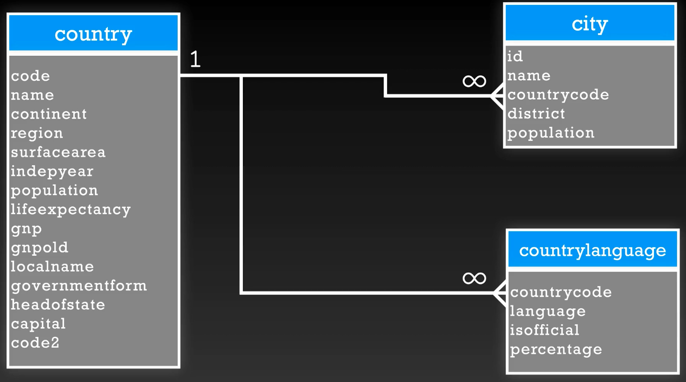

# Relaciones, llaves y constraints

> Nota: Se debe popular la base de datos con los scripts ubicados en `./ejercicios/population_data`la cual tiene la siguiente estructura:

<div align="center"> 
  
  
</div>
/Users/juanmanuelarmeroviveros/Documents/tips/img/postgress_seccion_3.png
## Tipo de relaciones

* Uno a uno:
    * Un registro de una tabla se relaciona con un solo registro de otra tabla.
    * Ejemplo: Un empleado tiene un solo número de seguro social.

* Uno a muchos:
    * Un registro de una tabla se relaciona con muchos registros de otra tabla.
    * Ejemplo: Un cliente puede tener muchas órdenes.

* Muchos a muchos:
    * Muchos registros de una tabla se relacionan con muchos registros de otra tabla.
    * Este tipo de relación requiere una tabla intermedia, dividiendo la relación en dos relaciones uno a muchos.
    * Ejemplo: Un estudiante puede inscribirse en muchos cursos y un curso puede tener muchos estudiantes.

* Relaciones auto-referenciales:
    * Una tabla se relaciona consigo misma.
    * Ejemplo: Un empleado puede tener un jefe que es otro empleado.


## Llaves

* Llave primaria:
    * Es un campo o conjunto de campos que identifica de manera única un registro en una tabla.
    * No puede tener valores nulos.
    * Cada tabla solo puede tener una llave primaria.
    * Ejemplo: `id` de una tabla de empleados.

* Super key:
    * Es un conjunto de campos que identifica de manera única un registro en una tabla.
    * Incluye a la llave primaria y a los candidate keys.
    * Ejemplo: `id` y `email` en una tabla de usuarios.

* Llave foránea:
    * Es un campo o conjunto de campos que se refiere a la llave primaria de otra tabla.
    * Se utiliza para establecer una relación entre dos tablas.
    * Puede tener valores nulos.
    * Ejemplo: `employee_id` en una tabla de órdenes.

* Candidate key:
    * Es un campo o conjunto de campos que puede ser una llave primaria.
    * Cumple con las mismas condiciones que una llave primaria.
    * Ejemplo: `email` en una tabla de usuarios.

* Composite key:
    * Es una llave que está compuesta por dos o más campos.
    * Se utiliza cuando un solo campo no puede identificar de manera única un registro.
    * Ejemplo: `employee_id` y `order_id` en una tabla de órdenes.


## Ejercicios

- Añadir llave primaria
```sql
SELECT * FROM country;

ALTER TABLE country ADD PRIMARY KEY (code);

-- Existe un registro con valor duplicado, lo cual impide crear la llave primaria
SELECT * FROM country WHERE code = 'NLD';
DELET FROM country WHERE code = 'NLD' and code2 = 'NA';
```

- Constraint - check, es un constraint que permite verificar si una condición es verdadera o falsa.
```sql
ALTER TABLE country ADD CHECK(
    surface_area > =0
)
```

- Check con multiples valores de string
```sql
SELECT DISTINCT continent FROM country;

ALTER TABLE country ADD CHECK(
    continent IN ('Asia', 'Europe', 'North America', 'Africa', 'Oceania', 'Antarctica', 'South America', 'Central America')
)
```

- Drop constraint
    ```sql
    ALTER TABLE country DROP CONSTRAINT "country_continent_check";
    ```

## Creacion de indices

- Crear indice unico
    ```sql
    CREATE UNIQUE INDEX "unique_country_name" ON country (name);
    ```

- Crear indice compuesto
    > Nota: existe un registro duplicado para el indice compuesto, por lo que se debe eliminar.

    ```sql
    CREATE UNIQUE INDEX "unique_name_countrycode_district" ON city (name, countrycode, district);
    ```
- Crear un indice no unico
    ```sql
    CREATE INDEX "index_district" ON country (district);
    ```


## LLaves foreaneas

- Crear llave foreanea en city
    >Nota: La creacion no se puede realizar debido a que no existe el countryCode = AFG en la tabla country. Se debe agregar el registro en la tabla country.
    ```sql
    ALTER TABLE city 
        ADD CONSTRAINT fk_country_code
        FOREIGN KEY (countrycode) 
        REFERENCES country (code);
    ```

    ```sql
    INSERT INTO country
		values('AFG', 'Afghanistan', 'Asia', 'Southern Asia', 652860, 1919, 40000000, 62, 69000000, NULL, 'Afghanistan', 'Totalitarian', NULL, NULL, 'AF');
    ```

- Crear llave foreanea en countrylanguage
    ```sql
    ALTER TABLE countrylanguage
        ADD CONSTRAINT fk_country_code
        FOREIGN KEY (countrycode)
        REFERENCES country (code);
    ```

- On Delete - cascade
    >Nota: cascada elimina los registros de la tabla referenciada.
    ```sql
    ALTER TABLE city
        ADD CONSTRAINT fk_country_code
        FOREIGN KEY (countrycode)
        REFERENCES country (code)
        ON DELETE CASCADE;
    ```