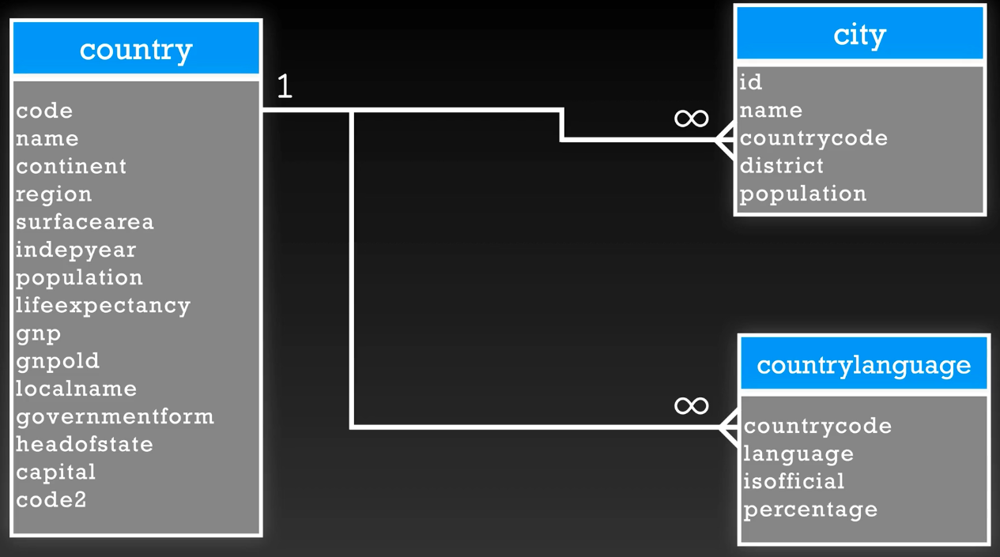

# Relaciones, llaves y constraints

> Nota: Se debe popular la base de datos con los scripts ubicados en `./ejercicios/population_data`la cual tiene la siguiente estructura:

 
  
  

/Users/juanmanuelarmeroviveros/Documents/tips/img/postgress_seccion_3.png
## Tipo de relaciones

* Uno a uno:
    * Un registro de una tabla se relaciona con un solo registro de otra tabla.
    * Ejemplo: Un empleado tiene un solo número de seguro social.

* Uno a muchos:
    * Un registro de una tabla se relaciona con muchos registros de otra tabla.
    * Ejemplo: Un cliente puede tener muchas órdenes.

* Muchos a muchos:
    * Muchos registros de una tabla se relacionan con muchos registros de otra tabla.
    * Este tipo de relación requiere una tabla intermedia, dividiendo la relación en dos relaciones uno a muchos.
    * Ejemplo: Un estudiante puede inscribirse en muchos cursos y un curso puede tener muchos estudiantes.

* Relaciones auto-referenciales:
    * Una tabla se relaciona consigo misma.
    * Ejemplo: Un empleado puede tener un jefe que es otro empleado.

