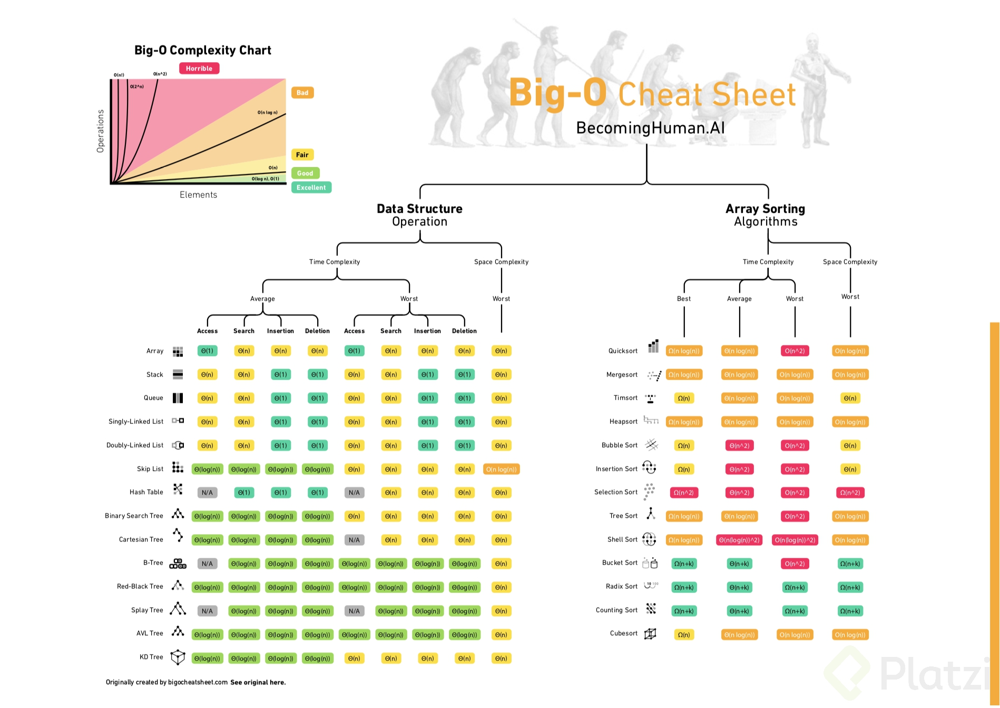

# Algorithmic Complexity Classes

There are different types of algorithmic complexity:

- **O(1) Constant:** Regardless of the input size, it always takes the **same amount of time**.
- **O(n) Linear:** The complexity will grow **proportionally** as the input grows.
- **O(log n) Logarithmic:** The function will grow **logarithmically** with respect to the input. This means that it will initially grow quickly but then stabilize.
- **O(n log n) Log-linear:** It will grow **logarithmically** but along with a **constant** factor.
- **O(n²) Polynomial:** It grows quadratically. Not recommended unless the input size is small.
- **O(2^n) Exponential:** It will grow **exponentially**, resulting in very high computational load. Not recommended in any case, only for conceptual analysis.
- **O(n!) Factorial:** It grows **factorially**, resulting in extremely high computational load. Never use algorithms of this type.

 
  

A loop typically contributes to linear growth, as its execution time increases linearly with the size of the input.

A loop within another loop often results in quadratic growth, as the execution time becomes proportional to the square of the input size.

Recursive calls, depending on how they are implemented, can lead to different levels of complexity. Some recursive algorithms can exhibit exponential growth, while others may have better complexity depending on the problem and how the recursion is structured.

In the case of merge sort, the time complexity is O(n log n), which means it has a better growth rate compared to algorithms with quadratic or exponential complexity. The merge sort algorithm divides the input list into smaller halves recursively until each sublist contains only one element. Then, it merges and combines these sorted sublists to obtain the final sorted list. The "divide and conquer" approach of merge sort leads to efficient sorting for large datasets.

The complexity of an algorithm or data structure can indeed vary depending on whether it involves an operation on a data structure or a sorting algorithm. It's important to consider that complexity can vary depending on the context and specific implementation of the algorithm or data structure. It is recommended to analyze complexity in terms of average case, worst case, and best case scenarios to fully understand the performance of an operation or algorithm.

 
  

