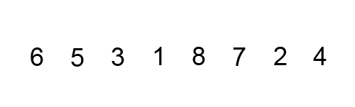

# Linear Search

The linear search is a very simple algorithm. It involves searching whether an element is present in a list, array, or an ordered or unordered system in order to determine if the element is in it or part of it.

What is the worst-case scenario for the following code? If we look closely, there is a for loop that grows according to the size of the list, which makes our Big O notation O(n).

```python
import random

def linear_search(lst, target):
    for element in lst:  # O(n)
        if element == target:
            return True
    return False


if __name__ == '__main__':
    list_size = int(input('What is the size of the list? '))
    target = int(input('Which number do you want to find? '))

    lst = [random.randint(0, 100) for _ in range(list_size)]

    found = linear_search(list, target)
    print(list)
    print(f'The element {target} {"is" if found else "is not"} in the list')
```

# Binary Search

The binary search algorithm follows a strategy called "Divide and Conquer," which involves dividing the problem in half at each iteration. This algorithm assumes that the list is sorted, so it is necessary to perform this step first.

Binary search is one of the most efficient search algorithms available today, as it significantly reduces the number of steps, thus decreasing our Big O complexity.

<div align="center">
  <h4>Average Case</h4>
</div>
<div align="center"> 
  
</div>


The time complexity of binary search is __O(log n)__, where __n__ is the size of the list.

```python
def binary_search(list, target):
    left = 0
    right = len(list) - 1

    while left <= right:
        mid = (left + right) // 2
        mid_value = list[mid]

        if mid_value == target:
            return True
        elif mid_value < target:
            left = mid + 1
        else:
            right = mid - 1

    return False

if __name__ == '__main__':
    list_size = int(input('What is the size of the list? '))
    target = int(input('Which number do you want to find? '))

    lst = sorted([random.randint(0, 100) for _ in range(list_size)])

    found = binary_search(list, target)
    print(list)
    print(f'The element {target} {"is" if found else "is not"} in the list')
```

# Bubble Sort

It is an algorithm that repeatedly traverses a list that needs to be sorted. It compares adjacent elements and swaps them if they are in the wrong order. This process is repeated until no more swaps are needed, indicating that the list is sorted.

<div align="center"> 
  
</div>

```python
import random

def bubble_sort(list):
    n = len(lst)
    swapped = True

    for i in range(n):
        if not swapped:
            break

        swapped = False

        for j in range(0, n - i - 1):
            if lst[j] > lst[j + 1]:
                lst[j], lst[j + 1] = lst[j + 1], lst[j]
                swapped = True

    return lst

if __name__ == '__main__':
    list_size = int(input('What is the size of the list? '))

    list = [random.randint(0, 100) for i in range(list_size)]
    print(list)

    sorted_list = bubble_sort(list)
    print(sorted_list)

```

# Insertion Sort

One characteristic of Insertion Sort is that it sorts "in-place." This means it does not require additional memory to perform the sorting since it simply modifies the values in memory.

    A list is divided into a sorted sublist and an unsorted sublist. Initially, the sorted sublist contains a single element, making it sorted by definition.

    Next, the first element in the unsorted sublist is evaluated to determine its correct position within the sorted list.

    Insertion is done by shifting all elements greater than the current element one position to the right.

    The process continues until the unsorted sublist is empty, resulting in a fully sorted list.

```python
def insertion_sort(list):
    for index in range(1, len(list)):
        current_value = list[index]
        current_position = index

        while current_position > 0 and list[current_position - 1] > current_value:
            list[current_position] = list[current_position - 1]
            current_position -= 1

        list[current_position] = current_value
```

# Merge Sort

Merge Sort is an algorithm that applies the "divide and conquer" concept. It first divides a list into equal halves until there are sublists of 1 or 0 elements. Then, it merges them back together in an ordered manner.
<div align="center"> 
  
</div>

```python
import random

def merge_sort(lista):
    if len(lista) <= 1:
        return lista
    
    medio = len(lista) // 2
    izquierda = lista[:medio]
    derecha = lista[medio:]
    
    izquierda = merge_sort(izquierda)
    derecha = merge_sort(derecha)
    
    return merge(izquierda, derecha)

def merge(izquierda, derecha):
    resultado = []
    i = j = 0
    
    while i < len(izquierda) and j < len(derecha):
        if izquierda[i] <= derecha[j]:
            resultado.append(izquierda[i])
            i += 1
        else:
            resultado.append(derecha[j])
            j += 1
    
    while i < len(izquierda):
        resultado.append(izquierda[i])
        i += 1
    
    while j < len(derecha):
        resultado.append(derecha[j])
        j += 1
    
    return resultado

if __name__ == '__main__':
    tamano_de_lista = int(input('De qué tamaño será la lista? '))
    
    lista = [random.randint(0, 100) for _ in range(tamano_de_lista)]
    print('Lista original:', lista)
    
    lista_ordenada = merge_sort(lista)
    print('Lista ordenada:', lista_ordenada)

```
